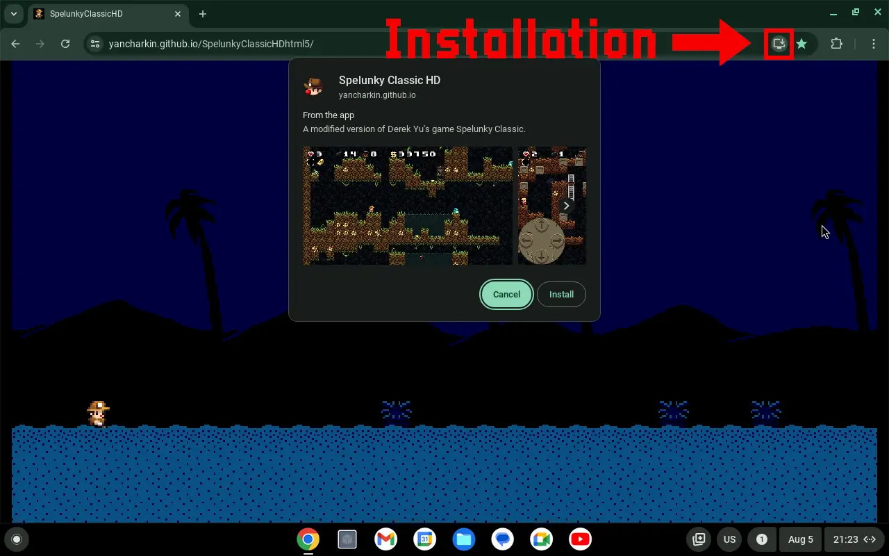
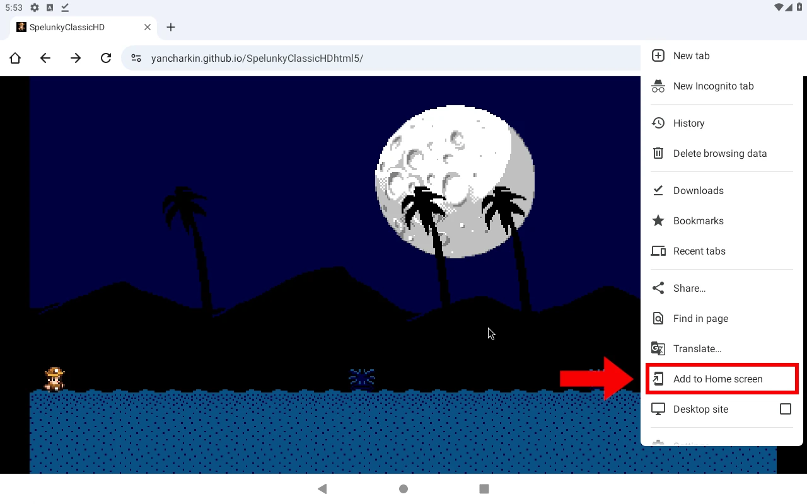
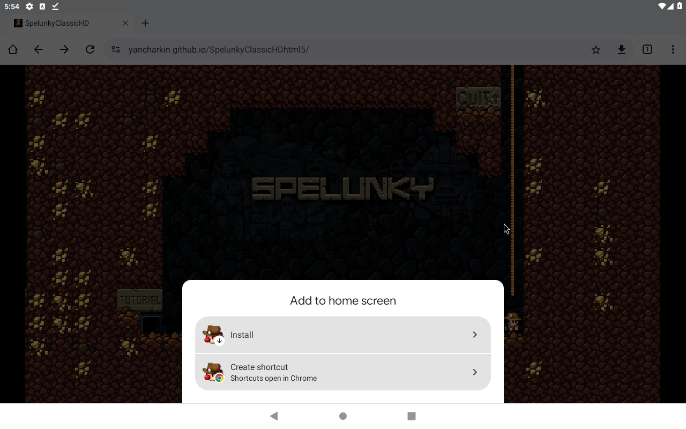

# Spelunky Classic HD HTML5 PWA

Web-version converted to [Progressive Web App](https://en.wikipedia.org/wiki/Progressive_web_app).
It can be installed by supported browsers (Google Chrome recommended) on desktop and mobile platforms as a standalone application for offline use.
Chromebook/Chrome OS users likely benefit the most from using it.

## Installation
- Go to https://yancharkin.github.io/SpelunkyClassicHDhtml5/
- Then:
  - on desktop
  - 
  - on mobile
  -  

## Known issues
- It is not obvious when all files are cached, and without some files the game won't work offline. Solution: wait a few minutes to ensure all files are cached.
- Fullscreen works not perfectly:
  - Esc key will exit fullscreen. Solution: do not use Esc, Tab set as a menu key as well
  - The game won't start fullscreen. Solution: add '--start-fullscreen' argument to shortcut/.desktop file or press F11 at the start
  - In fullscreen mode the game not really fills the screen. Solution: same as for the previous issue
