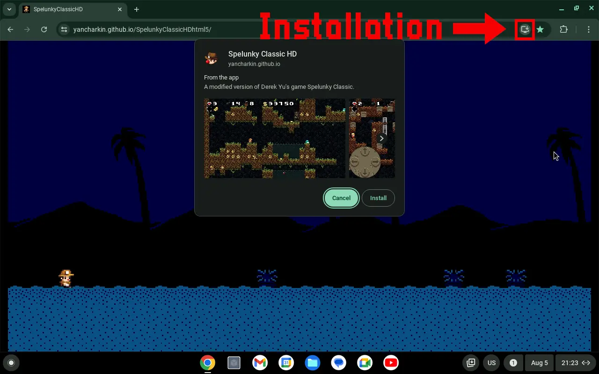
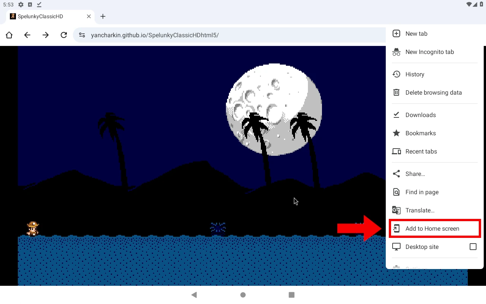
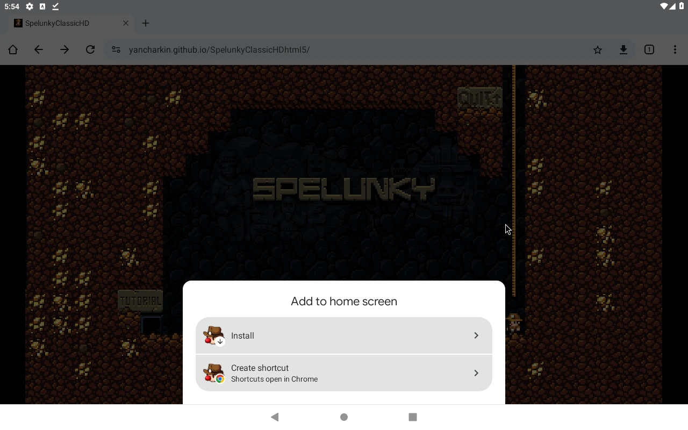

# Spelunky Classic HD  PWA

It can be installed by browsers that support PWAs on desktop and mobile platforms as a standalone application for offline use.

[More info about Progressive Web App](https://en.wikipedia.org/wiki/Progressive_web_app).

## Installation
- Go to https://yancharkin.github.io/SpelunkyClassicHDhtml5/
- Then:
  - on desktop
  - 
  - on mobile
  -  